# 카카오톡 쇼핑하기 FE 클론코딩

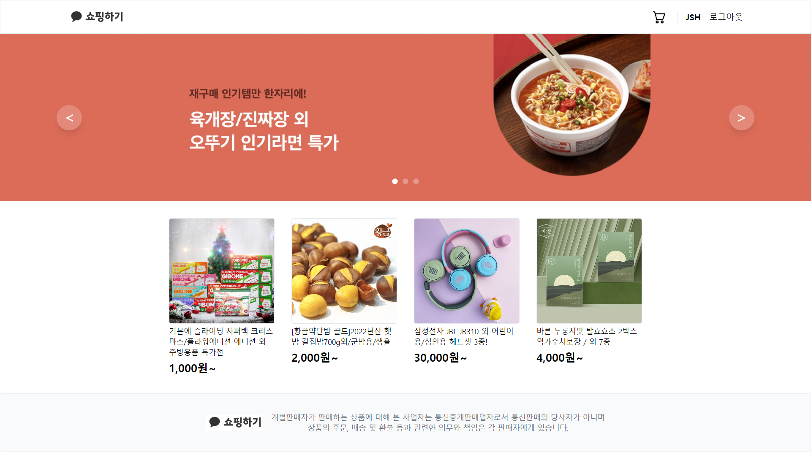

- 카카오 테크 캠퍼스 2단계 FE 클론 프로젝트
- '카카오톡 쇼핑하기'의 FE 핵심 기능을 클론 코딩으로 구현
- 06/26~08/04 + α 기간동안 진행

</br>

## 목차

- <a href="#프로젝트시작" style="color:black">프로젝트 시작</a>
- <a href="#프로젝트배포" style="color:black">프로젝트 배포</a>
- <a href="#기술스택" style="color:black">기술스택</a>
- <a href="#디렉터리구조" style="color:black">디렉터리 구조</a>
- <a href="#페이지구성" style="color:black">페이지 구성</a>
- <a href="#프로젝트후기" style="color:black">프로젝트 후기</a>

</br>

<span id="프로젝트시작"></span>

## 프로젝트 시작

- 프로젝트 다운로드
- 터미널로 프로젝트 디렉터리에서 하단의 명령어 실행

```
npm install
npm start
```

</br>

<span id="프로젝트배포"></span>

## 프로젝트 배포

### 배포 환경

- 카카오 크램폴린IDE(D2Hub, Kargo)

### 배포 방법

- 크램폴린IDE 접속
- main 브랜치 최신화
- D2Hub 빌드하기
- 배포하기
- Kargo에서 URL을 확인하여 웹사이트 접속 가능

### 유의사항

- `default.conf`, `Dockerfile` 파일에 문제 발생 시,</br>
  배포가 정상적으로 진행되지 않을 수 있음
- 프로젝트 실행 시와 배포 시의 이미지 경로에 차이가 존재하여,</br>
  이를 고려하여 수정해야 함

</br>

<span id="기술스택"></span>

## 기술 스택

<div style="padding:8px; display:flex; justify-content:center; gap:8px;">
  
  
  
  
  
  
  
</div>

```
- npm
JS 패키지 관리자

- create react app
react 앱 환경 구성 도구

- react router
react 앱 라우팅 라이브러리

- redux
상태 관리 라이브러리

- axios
브라우저와 node.js에서 사용 가능한 Promise 기반 HTTP 클라이언트 라이브러리

- react query
서버 데이터 패칭/캐싱/동기화 라이브러리(tanstack query로 명칭 변경)

- tailwind css
utility-first 지향 CSS 프레임워크
```

</br>

<span id="디렉터리구조"></span>

## 디렉터리 구조

```
step2-FE-kakao-shop         : 프로젝트 디렉터리
├─ node_modules             : npm 모듈
├─ public                   : non-compile 파일
│   └─ images               : 상품 이미지
├─ readme                   : README.md 사용 파일
└─ src                      : compile 파일
    ├─ apis                 : API 통신
    ├─ assets               : 에셋 이미지
    ├─ components           : 컴포넌트
    │   ├─ atoms            : 원자 단위 컴포넌트
    │   ├─ molecules        : 분자 단위 컴포넌트
    │   ├─ organisms        : 유기체 단위 컴포넌트
    │   └─ templates        : 템플릿 단위 컴포넌트
    ├─ hooks                : 커스텀 훅
    ├─ pages                : 페이지
    ├─ store                : 전역 저장소
    ├─ tests                : 테스트
    └─ utils                : 상수, 유틸리티 함수
```

<br />

<span id="페이지구성"></span>

## 페이지 구성

### 회원 가입 페이지

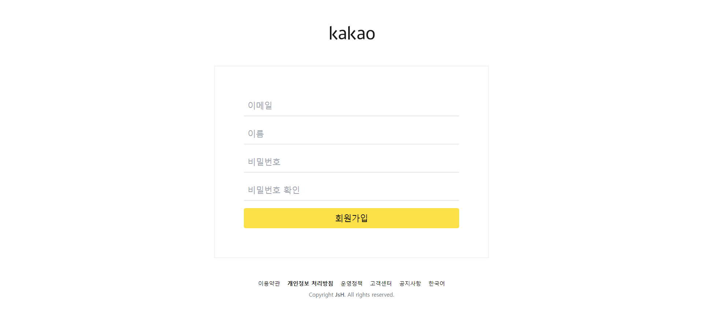

- **핵심기능**
  - 서비스 가입을 위한 회원 가입
- **기능상세설명**
  - 이메일/이름/비밀번호/비밀번호(확인) 입력
  - 각 입력에 대한 유효성 검사 진행
    - 이메일 : 영문+숫자@영문+숫자.영문+숫자, 중복불가
    - 비밀번호 : 영문+숫자+특수문자, 공백 없음, 8~20자
    - 비밀번호(확인) : 비밀번호 동일
  - 부적합 데이터 입력 시 대응 알림 표시
  - 버튼 클릭 시 BE 서버에게 데이터 전송
- **인터페이스 요구사항**
  - 입력 : 이메일, 이름, 비밀번호, 회원가입 버튼
  - 출력 : 로그인 페이지

### 로그인 페이지

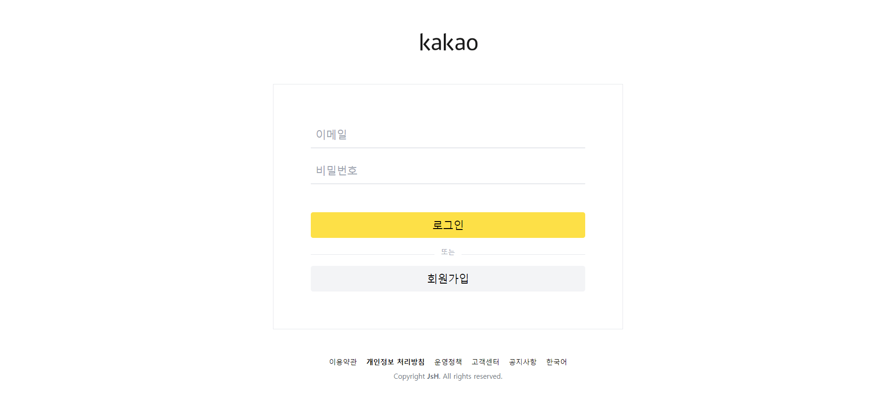

- **핵심기능**
  - 서비스 사용을 위한 로그인
  - 회원가입 페이지 이동
- **기능상세설명**
  - 이메일/비밀번호 입력
  - 각 입력에 대한 유효성 검사 진행
  - 부적합 데이터 입력 시 대응 알림 표시
  - 버튼 클릭 시 BE 서버에게 데이터 전송
  - 가입되지 않은 데이터일 경우 알림 표시
  - 가입된 데이터일 경우 로그인 수행(로그인 상태 적용)
  - 회원가입 버튼 클릭 시 회원가입 페이지 이동
- **인터페이스 요구사항**
  - 입력 : 이메일, 비밀번호, 로그인/회원가입 버튼
  - 출력 : 메인/회원가입 페이지

### 레이아웃

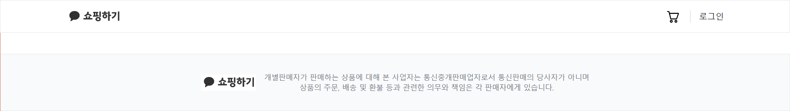<br />
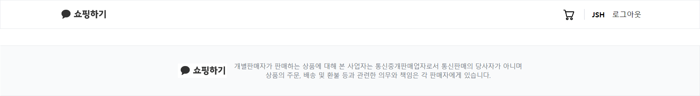

- **핵심기능**
  - 주요 페이지 이동
  - 로그인/로그아웃 수행
- **기능상세설명**
  - 버튼 클릭 시 메인 페이지/장바구니 페이지 이동
  - 현재 로그인 상태에 따라 로그인/사용자(로그아웃) 표시
  - 버튼 클릭 시 로그아웃 수행(로그인 상태 제거)
- **인터페이스 요구사항**
  - 입력 : 메인/장바구니/로그인/로그아웃 버튼
  - 출력 : 메인/장바구니/로그인 페이지

### 상품 목록 페이지(메인)


- **핵심기능**
  - 상품 목록 표시
  - 상품 상세 페이지 이동
- **기능상세설명**
  - BE 서버에게 상품 목록 정보 요청
  - 캐러셀 방식으로 주요 상품 정보 표시
  - 캐러셀 하단에 상품 목록 정보 표시
  - 상품 클릭 시 대응 상품 상세 페이지 이동
- **인터페이스 요구사항**
  - 입력 : 개별 상품 선택
  - 출력 : 상품 상세 페이지

### 상품 상세 페이지

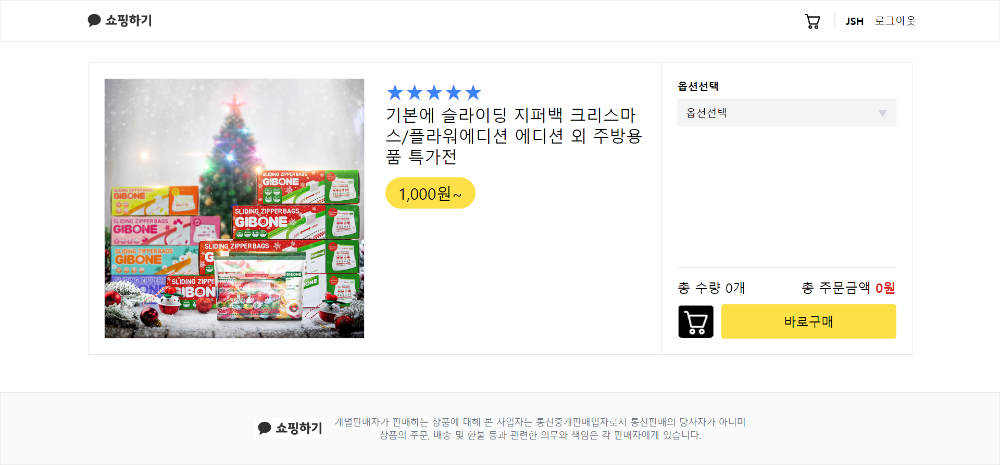</br>
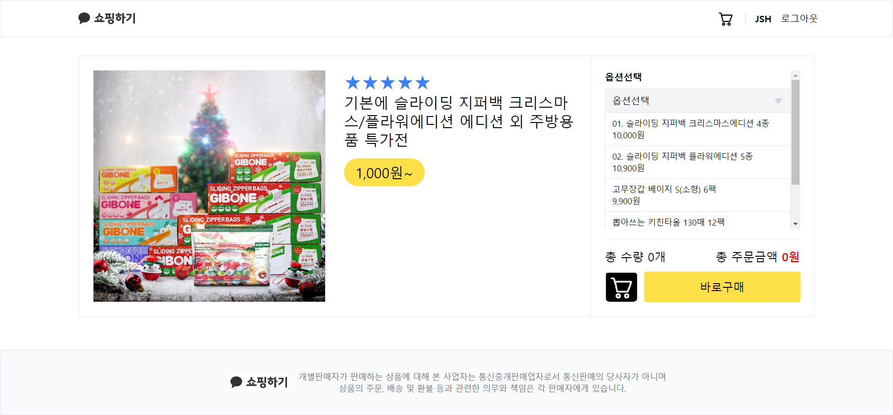</br>
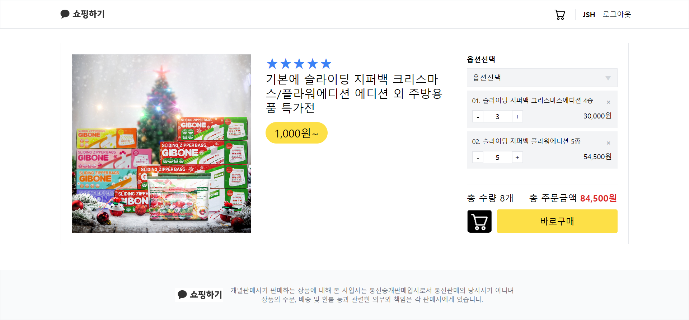

#### 1. 상품 정보

- **핵심기능**
  - 개별 상품 정보 표시
- **기능상세설명**
  - BE 서버에게 개별 상품 정보 요청 및
  - 개별 상품 정보 표시
- **인터페이스 요구사항**
  - 출력 : 개별 상품 정보

#### 2. 옵션 선택

- **핵심기능**
  - 옵션 선택
- **기능상세설명**
  - 옵션 선택
  - 중복 옵션 시 선택 취소
  - 미중복 옵션 시 옵션 추가
- **인터페이스 요구사항**
  - 입력 : 옵션 선택
  - 출력 : 옵션 추가

#### 3. 옵션 확인 & 수량 결정

- **핵심기능**
  - 선택된 옵션 재확인
  - 옵션 수량 결정
  - 합계 가격 표시
- **기능상세설명**
  - 선택된 옵션 표시
  - 선택된 옵션 수량 선택
  - 선택된 옵션의 합계 가격 표시
- **인터페이스 요구사항**
  - 입력 : 선택된 옵션 수량 선택(+/-)
  - 출력 : 변경된 옵션, 합계 가격

#### 4. 장바구니 담기/주문하기

- **핵심기능**
  - 선택된 옵션을 장바구니에 담거나 바로 주문하기
- **기능상세설명**
  - BE 서버에게 선택된 옵션 전송
  - 알림 표시
- **인터페이스 요구사항**
  - 입력 : 장바구니/구매하기 버튼
  - 출력 : 알림, 주문하기 페이지

### 장바구니 페이지

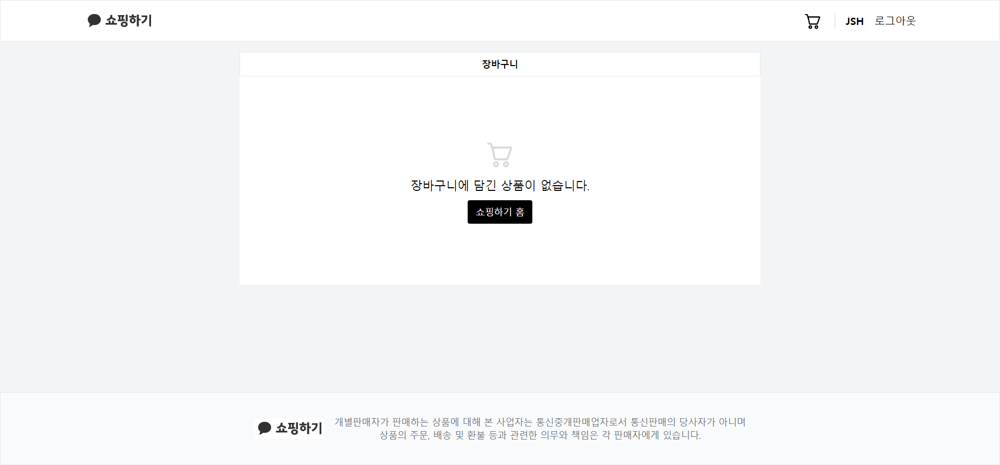</br>
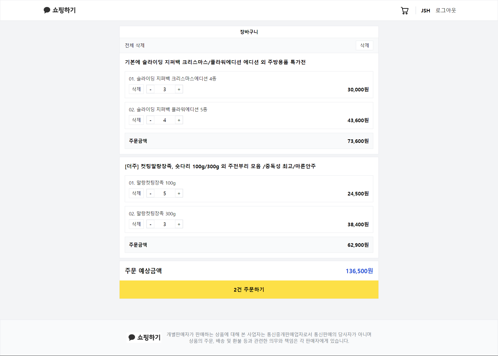

- **핵심기능**
  - 장바구니 조회 및 수정
  - 주문하기 페이지 이동
- **기능상세설명**
  - BE 서버에게 장바구니 정보 요청
  - 장바구니 정보 표시
  - 소계/합계 가격 표시
  - 장바구니 정보 변경
  - 변경 시 BE 서버에게 변경된 장바구니 정보 전송 후 재표시
- **인터페이스 요구사항**
  - 입력 : 장바구니 정보 변경(+/-), 주문하기 버튼
  - 출력 : 변경된 장바구니 정보, 소계/합계 가격, 주문하기 페이지

### 주문하기 페이지

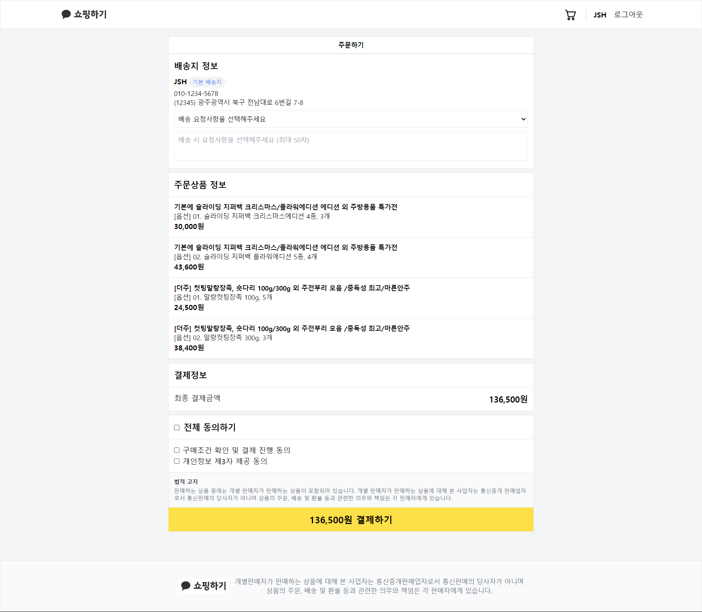

- **핵심기능**
  - 주문상품 정보 표시
  - 장바구니 결제 진행
- **기능상세설명**
  - BE 서버에게 장바구니 정보 요청
  - 주문 상품 정보 표시
  - 합계 가격 표시
  - 권한 동의 입력
  - 결제하기 클릭 시 결제 진행 후 주문 결과 페이지로 이동
  - (실제 결제 절차는 생략하고 BE 서버에게 결제 정보 전송)
- **인터페이스 요구사항**
  - 입력 : 권한 동의(체크 박스), 결제하기 버튼
  - 출력 : 주문 결과 페이지

### 주문 결과 페이지

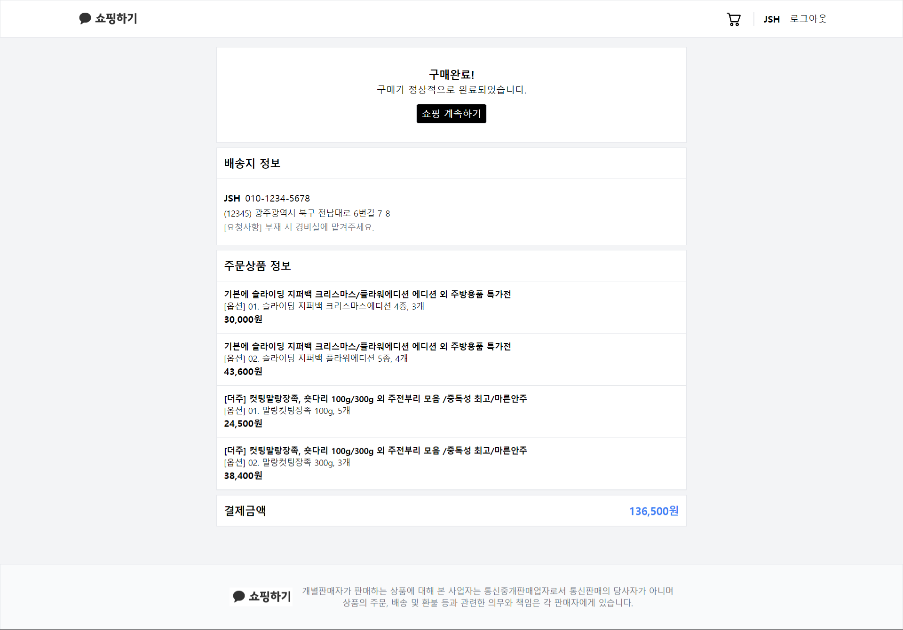

- **핵심기능**
  - 주문 결과 확인
- **기능상세설명**
  - BE 서버에게 주문 결과 확인 요청
  - 주문 결과(주문 정보, 결제 금액) 표시
- **인터페이스 요구사항**
  - 입력 : 계속하기 버튼
  - 출력 : 주문 결과, 메인 페이지

<span id="프로젝트후기"></span>
